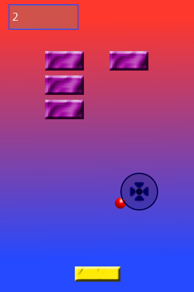
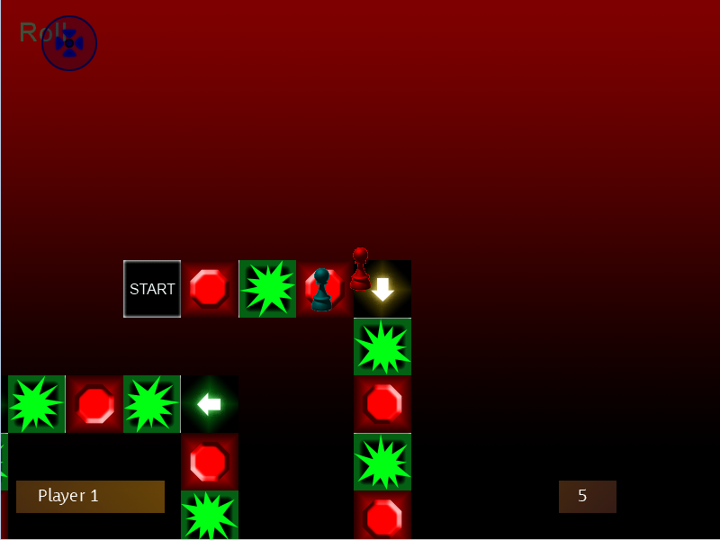

**Project Description**
The Helium XNA game engine is a light portable game engine designed to work on many platforms and soon to be expanded on more. Currently the helium game engine can be easily run on Windows, Xbox, and Windows Phone and with a coming port to the iPhone and SilverLight.

_Screenshot of the sample Breakout style game 'Breakfree'_

_Screenshot of the sample PixelBoard, this sample shows how to use gamestates to do more then just run your one game state_

_Screenshot of the Photon Particle Editing Tool, Listed in the downloads section_